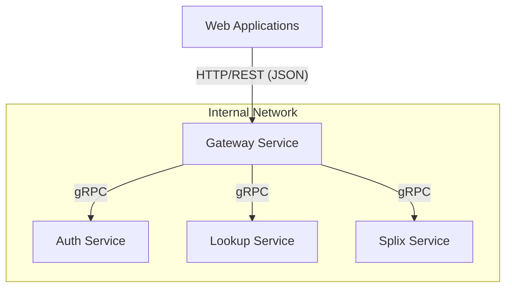

# Gateway Service

## 🎯 Purpose
The **Gateway Service** acts as the primary entry point for all web applications within the `halooid` ecosystem. Its core purpose is to bridge the gap between the web (HTTP/REST) and internal backend services (gRPC).

## 📍 Scope
The Gateway is responsible for:
- Exposing REST API endpoints for web-based consumers.
- Managing gRPC client connections to various backend services.
- Handling cross-cutting concerns like CORS and logging for the web layer.
- Translating HTTP-based authentication (JWT) into gRPC metadata.

## 🧩 Responsibilities
- **Protocol Translation**: Converts REST/HTTP requests into gRPC calls and maps gRPC responses back to JSON.
- **Request Routing**: Proxying requests to the appropriate downstream microservice (Auth, Lookup, Splix, etc.).
- **Security**: Validating HTTP headers and propagating authentication context to internal services.
- **Observability**: Logging incoming requests and providing health check endpoints.

## 🔗 Dependencies
- **Auth Service**: Manages identity, token validation, and user profiles.
- **Lookup Service**: Provides static and dynamic system lookup data.
- **Splix Service**: Handles core business logic for expense sharing and groups.

## 🔄 Data Flow / Interaction
The following diagram illustrates how the Gateway facilitates communication between web clients and backend services:

## 🧠 Key Decisions
- **Minimal Business Logic**: Adhering to the principle that the gateway should remain thin. Business logic resides strictly within the domain-specific services.
- **Custom Handlers**: Instead of a generic proxy, explicit handlers are used to provide better control over API design and error mapping between REST and gRPC.

## ⚠️ Constraints / Rules
- **No Data Persistence**: The Gateway does not own a database; it is entirely stateless.
- **Mobile Bypass**: Flutter mobile applications communicate directly with gRPC services via proto contracts, bypassing the Gateway.
- **Contract Driven**: All interactions with backend services are strictly governed by Protobuf definitions.

## 🛠️ Implementation Notes
- **Language**: Go
- **Framework**: Standard `net/http` for the server, `grpc-go` for service clients.
- **Configuration**: Environment variables are used for service addresses and port configuration.
- **Middleware**: Includes custom logging and CORS middleware to support web client interactions.

## 📚 Related Docs
- [Overall Project Guidelines](file:///Users/jerin/Documents/Projects/halooid/overall-project-guidelines.md)
- [Go Backend Guidelines](file:///Users/jerin/Documents/Projects/halooid/grpc-gackend-guidelines.md)
- [Proto Guidelines](file:///Users/jerin/Documents/Projects/halooid/grpc-proto-guidelines.md)
